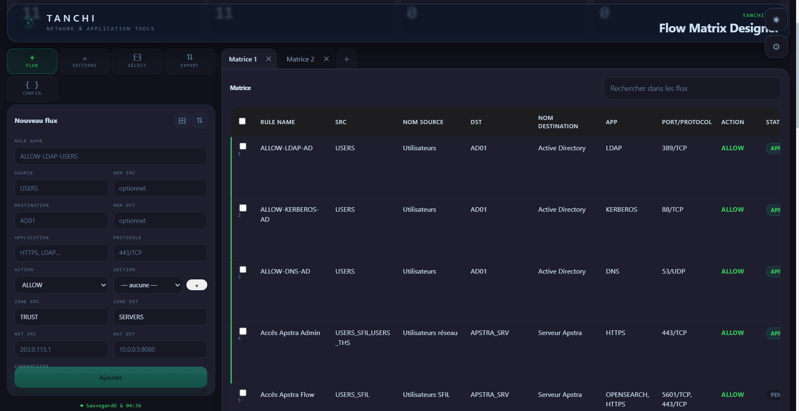

# Tanchi Flow Matrix Designer


**Tanchi Flow Matrix Designer** is a cutting-edge tool designed for creators, systems engineers, and workflow architects. It enables the conceptualization, modeling, and optimization of data matrices, workflows, or complex movement choreographies through an intuitive and highly visual interface.

Built using **Tauri**, **React**, and **TypeScript** with **Vite** for a lightweight, high-performance desktop experience.



---

## 🌟 Key Features

* **Intuitive Matrix Designer:** Seamlessly manipulate complex grids and nodal structures using an advanced drag-and-drop system.
* **Dynamic Flow Visualization:** Track your data paths or movement patterns in real-time powered by a high-performance rendering engine.
* **Optimization Algorithms:** Instantly identify bottlenecks, flow disruptions, or redundancies within your matrices.
* **Aesthetic Customization:** Fully customize the visual style (colors, gradients, transition curves) to create presentations that are as beautiful as they are functional.
* **Multi-Format Export:** Export your matrices as code (JSON, XML), vector files (SVG), or data sheets in a single click.

## 🚀 Target Audience

* **UX/UI & Game Designers:** For mapping user journeys, branching dialogues, or in-game economy systems.
* **Data Architects & Engineers:** For modeling data pipelines and complex operational workflows.
* **Digital Artists & Choreographers:** For planning LED matrices, camera paths, or interactive stage performances.

## 💻 Core Features & Interface Breakdown

Tanchi Flow Matrix Designer provides a cutting-edge, dark-themed dashboard built to model, visualize, and audit complex network security policies, rulesets, and application flows. 

Here is everything you can do with the platform:

### 1. Unified Dashboard & Live KPIs
Monitor the overall health and state of your matrix in real-time using high-visibility metrics at the top of the screen:
* **Total Flows Counter:** Displays the global number of active connection paths and rules configured within the current matrix.
* **ALLOW / DENY Trackers:** Instant visual breakdown of explicitly authorized vs. blocked traffic rules.
* **Conflict & Anomaly Detection:** Real-time alert system to spot rule overlaps, shadowing, or security redundancies immediately.
* **Multi-Matrix Tabs:** Seamlessly toggle between independent network layouts (e.g., `Matrice 1`, `Matrice 2`) or spin up a new workspace with a single click.

### 2. Granular Flow Creator Panel
The powerful left sidebar allows you to surgically design and provision rules with comprehensive technical parameters:
* **Rule Naming Conventions:** Define clean, standardized rule identities (e.g., `ALLOW-LDAP-USERS`).
* **Source & Destination Mapping:** Map explicit subnets, security groups, or user environments (e.g., `USERS` to `AD01`) with optional descriptive aliases for clarity (e.g., *Active Directory*).
* **Application & Protocol Filtering:** Target specific infrastructure services (e.g., `LDAP`, `KERBEROS`, `DNS`, `HTTPS`) alongside precise port/protocol definitions (e.g., `389/TCP`, `443/TCP`).
* **Advanced Routing & Scoping:** Assign rules to strict architectural zones (`TRUST`, `SERVERS`), manage Source/Destination NAT configurations, handle firewall sectioning, and append audit logs or comments.

### 3. Interactive Flow & Network Choreography
The application's graphical centerpiece translates dry firewall tables into a beautiful, dynamic node graph:
* **Dynamic Node Mapping:** Visualize complex paths tracing sources directly to their targeted destination assets through logical connection lines.
* **Visual Link Analytics:** Lines dynamically adapt their colors based on policy actions (`ALLOW` paths light up in emerald green, `DENY` paths in crimson) and stack into grouped pathways (e.g., `3 flux`) to avoid visual clutter.
* **Live JSON Configuration Window:** Toggle the `{ } CONFIG` panel to view, inspect, or directly edit the raw underlying JSON data structure in real-time—perfect for automation pipelines or advanced power users.

### 4. Advanced High-Performance Ruleset Table
The bottom grid provides a clean, enterprise-grade data layout designed to manage large-scale configurations:
* **Instant Search & Query Filtering:** Use the global search bar (`Rechercher dans les flux`) to instantly filter through thousands of entries by rule name, application profile, IP address, port, or active status.
* **Deployment Status Badges:** Track whether your policies are successfully provisioned, active, or pending via clear contextual indicators (`ALLOW`, `DENY`, `APPLIED`).

### 5. Bulk Selection & Mass Management Tools
Streamline heavy operational tasks using the dedicated selection controls located in the action bar:
* **Mass Selection (`SÉLECT`):** Toggle checkboxes across multiple rules simultaneously to execute batch actions, preventing the need to modify rules one by one.
* **Section Organizing (`SECTIONS`):** Group selected flows into distinct logical blocks or firewall zones in a single command to keep massive rulesets perfectly ordered.

### 6. Backup, Synchronization & Multi-Format Export System
Never lose a configuration with built-in export and backup utilities designed for devops pipelines and infrastructure teams:
* **One-Click Export (`EXPORT`):** Instantly package your entire matrix or selected rule subsets. It prepares data for smooth deployment into production firewalls or routers.
* **Live Configuration State:** The interface features a constant auto-save tracker (e.g., `Sauvegardé à 04:46`) to ensure your local work is always cached and protected against unexpected crashes.
* **Universal JSON Portability:** Because the system compiles everything into a clean, unified JSON structure, backups are highly portable. You can version-control your network matrices on Git just like regular code (Infrastructure as Code).

---

## 🛠️ Recommended IDE Setup

* [ZED](https://zed.dev/) --> [Zed Github](https://github.com/zed-industries/zed)
* [Tauri VS Code Extension](https://marketplace.visualstudio.com/items?itemName=tauri-apps.tauri-vscode)
* [rust-analyzer](https://marketplace.visualstudio.com/items?itemName=rust-lang.rust-analyzer)

## 📦 Installation & Development

1. **Clone the repository:**
   ```bash
   git clone https://github.com/NuxsGit/Tanchi-FlowMatrix-Designer.git
   cd Tanchi-FlowMatrix-Designer
   
2. **"npm run tauri dev" or "npm run tauri build"**
